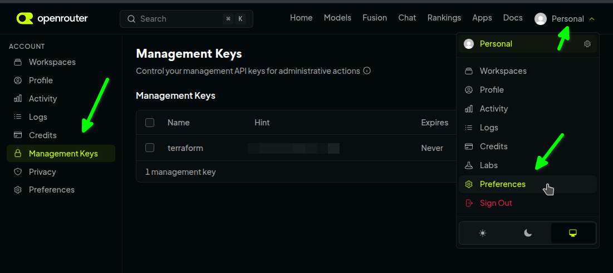

# OpenRouter

## Usage

1. Call `tofu init`
1. Call `TF_VAR_passphrase=mypassword OPENROUTER_API_KEY=yourApiKey tofu apply`
1. To display created API key call `TF_VAR_passphrase=mypassword tofu output <name>`

## Management Key

Create management key in [OpenRouter -> Profile -> Account -> Management Keys](https://openrouter.ai/settings/management-keys)

